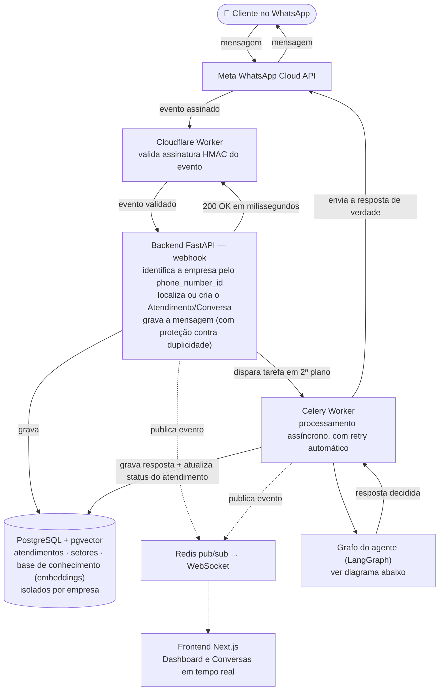
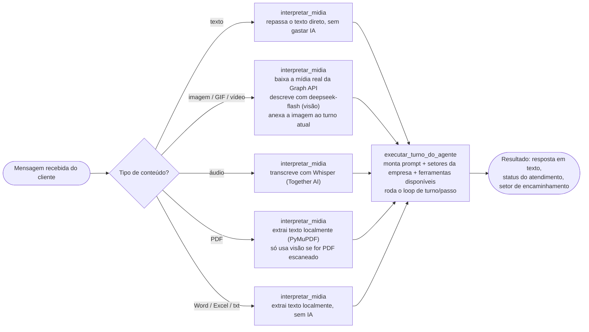
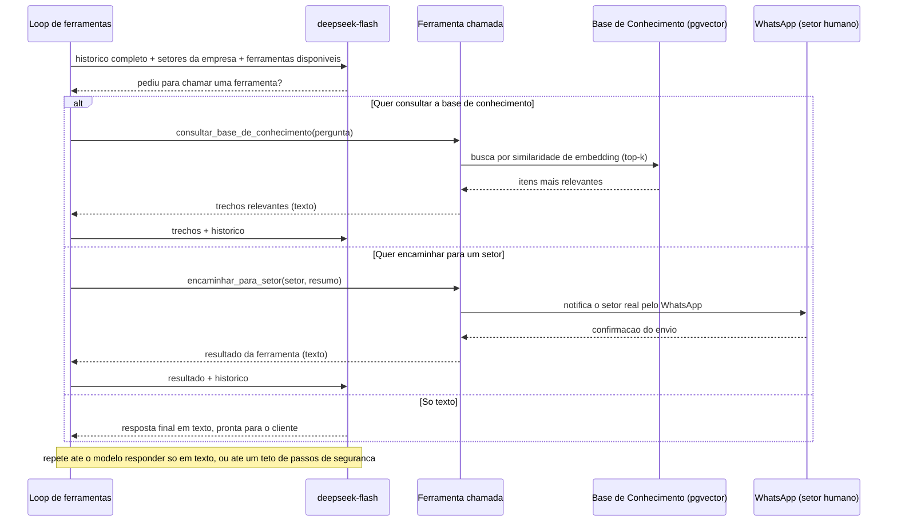
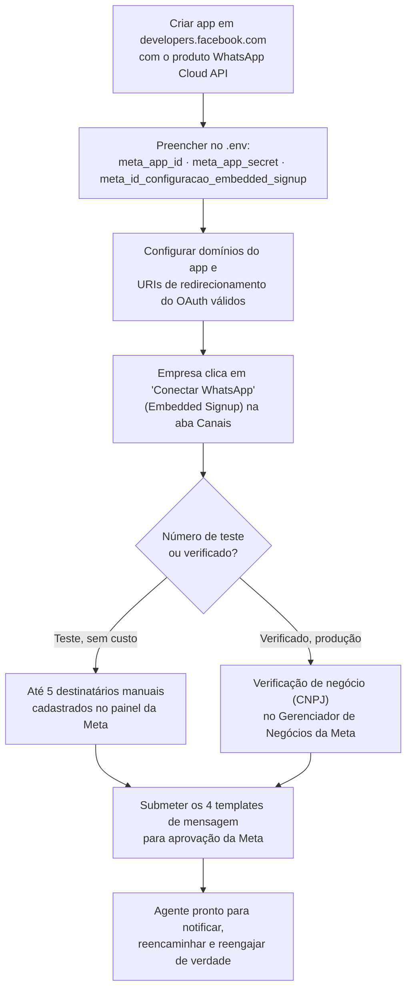

# Agente de Atendimento

Plataforma SaaS multi-tenant de um agente de IA para **atendimento receptivo** pelo WhatsApp — a empresa cadastra seus setores e sua base de conhecimento (políticas, FAQ, descrições de produto), e o agente faz a triagem de cada mensagem recebida: responde sozinho usando busca semântica na base de conhecimento, ou encaminha para o setor humano certo quando não consegue.

Cada empresa que se cadastra ganha seu próprio agente, isolado das demais, sem precisar de uma implantação separada: é a mesma aplicação atendendo várias empresas ao mesmo tempo, cada uma vendo apenas os seus próprios dados.

🔗 **Aplicação em produção:** [agenteatendimento.projetostechmauricio.lol](https://agenteatendimento.projetostechmauricio.lol/)

## 1. O problema que este projeto resolve

Empresas que recebem mensagens de clientes pelo WhatsApp costumam depender de um time humano até para perguntas repetitivas — horário de funcionamento, política de troca, como usar um produto — que já estão documentadas em algum lugar, só não de um jeito que o cliente consiga achar sozinho. Este projeto automatiza a primeira linha desse atendimento: o agente lê a base de conhecimento da empresa, responde o que consegue responder com segurança, e só aciona um humano quando a pergunta foge do que está documentado ou exige uma ação humana de verdade.

O agente é **receptivo** por natureza: não existe abordagem automática nem importação de contatos — todo atendimento nasce sozinho, na primeira mensagem que o cliente manda. E o desfecho não é fixo: cada atendimento pode ser encaminhado para qualquer setor que a empresa cadastrar (Vendas, Financeiro, Suporte Técnico, ou o que fizer sentido para o negócio dela) — o roteamento é decidido caso a caso, não configurado uma vez só para toda a empresa.

## 2. Demonstração

Três vídeos mostrando o agente funcionando de ponta a ponta pelo WhatsApp de verdade — do lado do cliente e do painel em tempo real.

**2.1 Demonstração da plataforma**

https://github.com/user-attachments/assets/bca20643-888b-4f6a-83a9-8d7d71ec792c

**2.2 Demonstração do funcionamento do agente no WhatsApp**

https://github.com/user-attachments/assets/8d4763e5-7248-4c48-b068-8db9881848a6

**2.3 Outra demonstração do funcionamento do agente no WhatsApp**

https://github.com/user-attachments/assets/4a26de79-6d9d-437e-a1ff-e936331eec32

## 3. Funcionalidades

- **Dashboard** — 4 cartões de quantidade (total de atendimentos, em atendimento, encaminhados, resolvidos), 3 cartões de taxa (encaminhamento, resolução automática, reabertura), dois funis de barras (encaminhamento e resolução), um gráfico de volume de atendimentos por dia (rolagem horizontal para períodos longos), ranking dos setores mais acionados e filtro por período — a métrica central deste domínio é quanto a IA resolveu sozinha, sem gerar trabalho para um setor humano.
- **Base de Atendimentos** — todo atendimento nasce automaticamente da primeira mensagem do cliente pelo WhatsApp (sem criação/importação manual); tabela com filtro por status e busca, edição/exclusão manual, indicador de reabertura.
- **Conversas** — histórico completo de cada conversa, atualizado em tempo real via WebSocket assim que uma mensagem nova chega ou é enviada.
- **Setores** — CRUD dos setores da empresa (nome + descrição), usados pelo agente como destino de encaminhamento; o modelo só pode encaminhar para um setor que exista de verdade (validado em código, nunca confiado apenas na escolha da IA).
- **Base de Conhecimento** — CRUD de itens (título + conteúdo); cada item é convertido em embedding (busca semântica) na hora do cadastro/edição, e o agente consulta os itens mais relevantes para cada pergunta do cliente antes de responder.
- **Configuração do Agente** — perfil da empresa, roteiro de comportamento da conversa, e o bloco "Regras de Atendimento": exigir que toda resposta venha só da base de conhecimento (`responder_apenas_com_base_no_conhecimento`) e o texto a usar quando a pergunta foge do escopo cadastrado.
- **Canais** — conexão "um clique" do WhatsApp Business de cada empresa, via WhatsApp Embedded Signup da Meta, e as prévias dos 4 templates usados pelo agente (notificação ao setor, reencaminhamento, alerta de tentativa de manipulação, reengajamento de atendimento silencioso).
- **Integrações** — conexões de saída (notificação para sistemas externos da empresa).
- **Configurações** — dados gerais da conta da empresa na plataforma.
- **Cadastro e login** — cada empresa cria sua própria conta; os dados de uma empresa nunca ficam visíveis para outra.

## 4. Arquitetura

O frontend (Next.js) e o backend (FastAPI) ficam atrás de um único endereço público, roteado pelo Caddy — que também cuida da emissão automática do certificado HTTPS.

### 4.1 Visão geral — da mensagem do cliente até a resposta de volta



### 4.2 O grafo do agente — o que acontece a cada mensagem recebida

Duas etapas (nós do LangGraph), sempre na mesma ordem — sem "checkpointer": o histórico completo já mora no Postgres, então cada execução roda do zero com o histórico inteiro como entrada.



### 4.3 Triagem → FAQ (RAG) → roteamento — tudo dentro de UM agente

Esse fluxo inteiro acontece dentro do **mesmo** loop de turno/passo — o modelo decide, turno a turno, se consulta a base de conhecimento, se encaminha para um setor, ou se responde direto. Não é um fluxograma fixo em código escolhendo a ação — o **próprio modelo** recebe as ações disponíveis como ferramentas de verdade e decide, dentro da própria resposta, se e qual delas chamar. Quando chama, a ferramenta **executa a ação de verdade na hora** — não apenas anota uma intenção para outro código decidir depois.



### 4.4 Ferramentas disponíveis para o modelo chamar

Definidas em `agente/ferramentas.py`, sempre em modo livre — nunca uma é forçada, o modelo decide sozinho se/quando/qual usar:

| Ferramenta | O que faz de verdade quando chamada |
|---|---|
| `consultar_base_de_conhecimento` | Busca por similaridade de embedding os itens mais relevantes para a pergunta do cliente |
| `encaminhar_para_setor` | Marca o atendimento como `ENCAMINHADO` e envia WhatsApp real para o setor (validado em código contra a lista real de setores da empresa) |
| `marcar_como_resolvido` | Marca o atendimento como `RESOLVIDO` — a IA respondeu sozinha, sem precisar de humano |
| `nao_responder` | Encerra o turno em silêncio proposital (ferramenta terminal — corta o loop na hora) |

## 5. Estrutura de pastas

```
agente-atendimento/
├── backend/                    # API em FastAPI
│   ├── app/
│   │   ├── modelos/             # Tabelas do banco (SQLAlchemy) — inclui Setor e ItemDeConhecimento
│   │   ├── esquemas/            # Formatos de entrada/saída da API (Pydantic)
│   │   ├── rotas/               # Endpoints da API
│   │   ├── agente/               # Grafo LangGraph, prompts, guardrails e orquestração
│   │   ├── integracoes_externas/ # Clientes da DeepSeek, OpenAI (embeddings), Together AI (transcrição) e da WhatsApp Cloud API
│   │   ├── midia/                 # Leitura de arquivos recebidos em conversa (PDF etc.)
│   │   └── tarefas/              # Tarefas assíncronas do Celery
│   ├── alembic/                  # Migrações do banco de dados
│   └── testes/                   # Testes automatizados (pytest)
├── frontend/                   # Interface em Next.js
│   └── src/
│       ├── app/                  # Páginas (uma pasta por aba da plataforma, inclui setores/ e base-conhecimento/)
│       ├── componentes/          # Componentes de interface reutilizáveis
│       └── biblioteca/           # Cliente de API, tipos e autenticação
├── infra/
│   ├── cloudflare-webhook/       # Worker que valida e repassa os eventos da Meta
│   └── caddy/                    # Configuração do roteamento e HTTPS
├── scripts/
│   └── implantar_na_vm.sh        # Script de deploy
└── docker-compose.yml
```

## 6. Stack tecnológica

| Camada | Tecnologia | Por quê |
|---|---|---|
| Orquestração do agente | LangGraph | Grafo de dois nós (interpretar mídia → executar turno) — dentro do segundo, um loop de turno/passo com tool calling nativo deixa o próprio modelo decidir e EXECUTAR a ação (consultar a base de conhecimento, encaminhar para um setor etc.), em vez de um `if/elif` em Python interpretar uma saída fixa |
| Modelo de linguagem | DeepSeek (`deepseek-flash`) — conversa/ferramentas e interpretação de imagem/vídeo (multimodal nativo); PyMuPDF para texto de PDF (sem IA); Together AI (Whisper Large v3) para transcrição de áudio | Raciocínio, decisão de ferramentas e leitura de mídia enviada pelo cliente |
| Busca semântica (RAG) | OpenAI (`text-embedding-3-small`, 1536 dimensões) + pgvector | Embedding multilíngue de verdade (inclui português) para achar os itens de conhecimento mais relevantes por pergunta; reaproveita o MESMO Postgres da aplicação (extensão `pgvector`), em vez de um serviço de vetor separado — a Together AI (mesma conta usada para transcrição) parou de oferecer embeddings em modo serverless, só endpoint dedicado com custo fixo por hora |
| Backend | Python, FastAPI, WebSockets, async/await | API REST, autenticação, webhook e o canal de tempo real |
| Banco de dados | PostgreSQL (`pgvector/pgvector`) + SQLAlchemy + Alembic | Dados relacionais multi-tenant e coluna vetorial para embeddings, com migrações versionadas |
| Fila de tarefas | Celery + Redis | Processamento assíncrono das respostas da IA e da varredura de atendimentos silenciosos |
| Frontend | React, Next.js, TypeScript, Tailwind CSS | Interface do painel |
| Integração de mensagens | WhatsApp Business Cloud API (Meta) | Canal de conversa com os clientes |
| Borda/segurança do webhook | Cloudflare Workers | Validação de assinatura HMAC e resposta rápida à Meta |
| Infraestrutura | Docker, Docker Compose, Caddy (HTTPS automático) | Deploy reproduzível em qualquer VM Linux |
| Autenticação | JWT, bcrypt | Login isolado por empresa (multi-tenant) |

## 7. Configuração externa (Meta / WhatsApp Business)

O botão "Conectar WhatsApp" da aba Canais usa o WhatsApp Embedded Signup da Meta — a empresa faz login numa janela oficial da Meta e escolhe o número dela, sem precisar copiar nenhuma credencial manualmente. Para isso funcionar, é preciso um app criado em [developers.facebook.com](https://developers.facebook.com) com o produto WhatsApp Cloud API adicionado, e algumas configurações feitas no painel da Meta antes do primeiro uso:



| Variável | Onde encontrar | É segredo? |
|---|---|---|
| `meta_app_id` | Painel do app → "Identificação do app" | Não — usado pelo navegador |
| `meta_app_secret` | Configurações do app → Básico → "Chave Secreta do Aplicativo" (pede a senha da conta para revelar) | **Sim** — nunca é enviado ao navegador |
| `meta_id_configuracao_embedded_signup` | Login do Facebook para Empresas → Configurações → criar uma configuração pedindo as permissões `whatsapp_business_management` e `whatsapp_business_messaging` | Não |

Enquanto o app estiver em modo de desenvolvimento (o padrão logo após criado), o botão só funciona para pessoas com uma função no app (administrador, desenvolvedor ou testador). Isso é suficiente para testar a plataforma; abrir a conexão para qualquer empresa externa exige publicar o app e passar pela revisão da Meta (verificação de negócio e acesso avançado às permissões acima).

Três configurações adicionais, também no painel da Meta, são obrigatórias para o botão funcionar (sem elas o login falha com erros diferentes, dependendo de qual está faltando):

- **Configurações do app → Básico → "Domínios do aplicativo"**: adicione o domínio onde o projeto está publicado (ex.: `seu-dominio.com`).
- **Login do Facebook para Empresas → Início rápido → Web → "Site URL"**: preencha com `https://seu-dominio.com` — isso cria automaticamente uma plataforma "Site" em Configurações do app → Básico (etapa fácil de esquecer, mas obrigatória).
- **Login do Facebook para Empresas → Configurações**: ative "Entrar com o SDK do JavaScript" e adicione o mesmo domínio em "Domínios permitidos para o SDK do JavaScript"; adicione também `https://seu-dominio.com/canais` e `https://seu-dominio.com/` em "URIs de redirecionamento do OAuth válidos" (a Meta recusa a conexão sem isso, mesmo com os outros campos certos).

### 7.1 Número de teste vs. número real (produção)

Ao conectar pela primeira vez, a Meta normalmente atribui um **número de teste** gratuito à empresa — ótimo para experimentar a plataforma sem custo, mas com uma restrição importante: só entrega mensagem para até **5 números de telefone** cadastrados manualmente como destinatários permitidos (painel da Meta → WhatsApp → Configuração da API → "Para" → "Gerenciar lista de números de telefone"), cada um confirmado por um código de verificação. Isso é suficiente para a própria empresa testar o agente, mas não para atender clientes reais.

Para usar um **número de WhatsApp real**, sem esse limite, a empresa (com CNPJ) precisa passar pela **verificação de negócio da Meta** (Gerenciador de Negócios → Configurações de segurança → Verificação de negócio — envio de documentos da empresa). Depois de verificado, o número passa a receber mensagem de qualquer cliente normalmente, e as mensagens fora da janela gratuita de atendimento de 24h passam a ter custo real, cobrado pela Meta diretamente na conta de pagamento cadastrada naquele Gerenciador de Negócios — nunca na conta de quem criou o app usado para a conexão.

> Nota: o fluxo de conexão acima foi testado com uma conta da Meta que já tinha histórico/infraestrutura de negócio configurada. Se você estiver testando com uma conta pessoal do Facebook totalmente nova, é possível que a Meta peça uma etapa extra de verificação de identidade antes de liberar o Embedded Signup — isso é comportamento padrão da Meta para contas novas, não um problema deste projeto.

### 7.2 Submeter os templates de mensagem

Depois de conectar o WhatsApp, a aba Canais mostra os 4 templates que o agente usa (notificação ao setor, reencaminhamento, atenção e reengajamento) — **a submissão não é automática**: para cada um, clique em "Ver prévia do template" e depois em "Confirmar e enviar para análise" (o texto já vem pronto, com o nome do agente e da empresa preenchidos sozinhos). A Meta pode levar de algumas horas a alguns dias para aprovar — enquanto estiver "Em análise", a tela verifica sozinha a cada minuto. O agente só consegue encaminhar/notificar/reengajar de verdade depois que os templates relevantes estiverem aprovados.

### 7.3 Como testar

```bash
cd backend
python3 -m venv .venv && source .venv/bin/activate
pip install -r requirements.txt
pytest testes/ -v
```

## 8. Segurança

- Senhas nunca são armazenadas em texto puro (hash com bcrypt).
- Sessões usam tokens JWT com expiração.
- Cada requisição à API é automaticamente filtrada pela empresa do usuário logado — uma empresa nunca acessa dados de outra, inclusive na busca semântica da base de conhecimento.
- O webhook do WhatsApp valida a assinatura HMAC da Meta antes de qualquer processamento, e cada mensagem é deduplicada pelo ID único atribuído pela Meta.
- O agente só encaminha para um setor que exista de verdade no banco da empresa — validado em código, nunca confiado apenas na escolha do modelo.
- Nenhuma chave de API, token ou senha fica no código-fonte — tudo vem de variáveis de ambiente, fora do controle de versão.

---

Projeto de portfólio construído para demonstrar arquitetura de agentes de IA aplicados a atendimento ao cliente, com foco em SaaS multi-tenant, busca semântica (RAG) com pgvector, orquestração de agentes com LangGraph, processamento assíncrono e integração de canais de mensagem.
